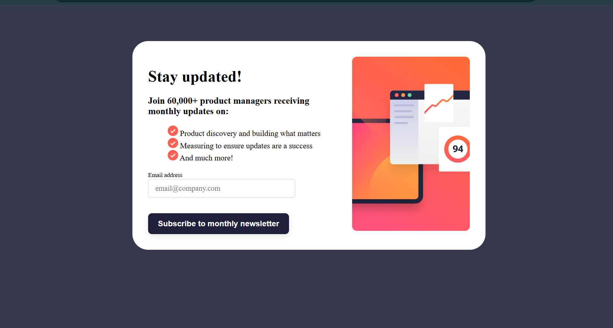
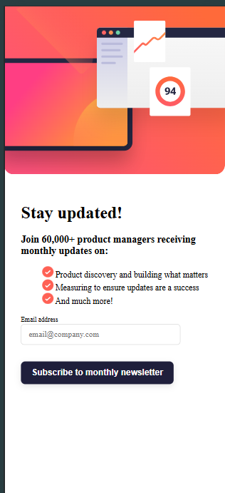

# Frontend Mentor - Newsletter sign-up form with success message solution

This is a solution to the [Newsletter sign-up form with success message challenge on Frontend Mentor](https://www.frontendmentor.io/challenges/newsletter-signup-form-with-success-message-3FC1AZbNrv). Frontend Mentor challenges help you improve your coding skills by building realistic projects. 

## Table of contents

  - [The challenge](#the-challenge)
  - [Screenshot](#screenshot)
  - [Links](#links)
  - [Built with](#built-with)
  - [What I learned](#what-i-learned)
  - [Acknowledgments](#acknowledgments)

### The challenge

Users should be able to:

- Add their email and submit the form
- See a success message with their email after successfully submitting the form
- See form validation messages if:
  - The field is left empty
  - The email address is not formatted correctly
- View the optimal layout for the interface depending on their device's screen size
- See hover and focus states for all interactive elements on the page

### Screenshot

### Links

- Live Site URL:https://the-holiest-potato.github.io/newsletter-signup-/

### Built with

- Semantic HTML5 markup
- CSS custom properties
- Flexbox
- CSS Grid
### What I learned

- HTML
   - Used 
, <form>, <input>, , and <button>.
   - Added separate images for mobile and desktop.

- CSS
   - Used flexbox for layout.
   - Made layout responsive with @media queries.
   - Styled hover effects and error states.
   - Fixed spacing issues on mobile.

- JavaScript
   - Validated email input.
   - Showed success message on valid input.
   - Displayed error message on invalid input.

# Acknowledgments

This project was completed as part of my frontend learning journey.
Thanks to:
- Online tutorials and documentation on HTML, CSS, and JavaScript
- Frontend Mentor (or design source) for the original design idea
- online communities and MDN
